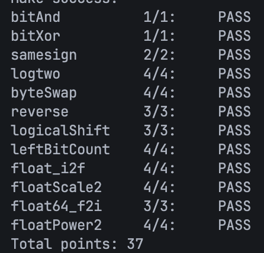

# datalab 报告

姓名：黄志贤

学号：2025201838

| 总分 | bitAnd | bitXor | samesign | logtwo | byteSwap | reverse | logicalShift | leftBitCount | float_i2f | floatScale2 | float64_f2i | floatPower2 |
| --------- | ------------- | ------------- | ------------- | ----------------- |-----------|-----------|-----------|-----------|-----------|-----------|-----------|-----------|
| 100.00         | 100.00             | 100.00             | 100.00             | 100.00 | 100.00 | 100.00 | 100.00 | 100.00 | 100.00 | 100.00 | 100.00 | 100.00 |


test 截图：


<!-- TODO: 用一个通过的截图，本地图片，放到 imgs 文件夹下，不要用这个 github，pandoc 解析可能有问题 -->

## 解题报告

### 亮点

<!-- 告诉助教哪些函数是你实现得最优秀的，比如你可以排序。不需要展开，展开请放到后文中。 -->

1. logtwo
2. leftBitCount

### bitAnd
```c
int bitAnd(int x, int y) {
    return ~( ~x | ~y);
}
```

列出真值表，发现 `|` 与 `&` 取反后是对称的

### bitXor

```c
int bitXor(int x, int y) {
    return ~( x & y ) & ~( ~x & ~y );
}
```

目标为“相同为假，不同为真”，只要两者相同，`(x & y)` 和 `(~x & ~y)` 就有一个为真，再利用与和或的取反对称性表达或的逻辑即可

### samesign
```c
int samesign(int x, int y) {
    if ((x^0) && (y^0)) { // 过滤含 0 情况
        return !((x >> 31) ^ (y >> 31)); // 依据符号位判断
    } else {
        return !(x^y); // 过滤都为 0 情况
    }
}
```

分为含零与不含零：
- 不含零：看符号位
- 含零：看是否都为零

### logtwo
```c
int logtwo(int v) {
    int b16 = v >= (1 << 16);
    v >>= (b16 << 4);
    int b8 = v >= (1 << 8);
    v >>= (b8 << 3);
    int b4 = v >= (1 << 4);
    v >>= (b4 << 2);
    int b2 = v >= (1 << 2);
    v >>= (b2 << 1);
    int b1 = v >= 2;
    int result = (b16 << 4) | (b8 << 3) | (b4 << 2) | (b2 << 1) | b1;
    return result;
}
```

根据题意，只需找到最高位的1所在的位数。

使用二分法，依次查询最高位的1在高 16/8/4/2/1 位还是在低 16/8/4/2/1 ，并将查询结果（0/1）作为是否右移 16/8/4/2/1 的依据，并在最后根据查询结果乘以对应的长度并相加

### byteSwap
```c
int byteSwap(int x, int n, int m) {

    // 位移量
    int N = n << 3;
    int M = m << 3;

    // 掩码
    int mask_n = 255 << N;
    int mask_m = 255 << M;

    int mask = mask_n | mask_m;

    // 过滤
    int result = x ^ (x & mask);

    int nth_byte = x & mask_n;
    int mth_byte = x & mask_m;

    // 换位
    nth_byte = (nth_byte >> N) << M;
    mth_byte = (mth_byte >> M) << N;

    result = result | (nth_byte & mask_m) | (mth_byte & mask_n);

    return result;
}
```

构造掩码把第n、m位分别单独拿出来并左移/右移一定位（先右移再左移以防止溢出），过滤掉原有的第n、m位，再将三个部分拼接

### reverse
```c
unsigned reverse(unsigned v) {
    unsigned result = 0;

    for (int i=0; i-16; i++) {
        unsigned mask_r = 1 << i;
        unsigned mask_l = 1 << (31 - i);

        unsigned r = v & mask_r;
        unsigned l = v & mask_l;

        r = (r >> i) << (31 - i);
        l = (l >> (31 - i)) << i;

        result = result | r | l;
    }
    return result;
}
```

采用`byteSwap`题的思路并加上循环

### logicalShift
```c
int logicalShift(int x, int n) {
    int mask = x >> 31 << 31 >> n << 1;

    int result = x >> n;

    return result ^ mask;
}
```

先做算数位移，再构造掩码将高位补充的位置零

### leftBitCount
```c
int leftBitCount(int x) {
    int y = ~x;
    y |= y >> 1;
    y |= y >> 2;
    y |= y >> 4;
    y |= y >> 8;
    y |= y >> 16;
    y = ~y;

    int mask = 0x11111111;
    int cnt = (y & mask) + ((y >> 1) & mask) + ((y >> 2) & mask) + ((y >> 3) & mask);
    mask = 0x0000ffff;
    cnt = (cnt & mask) + ((cnt & (mask << 16)) >> 16);
    mask = 0x00000f0f;
    cnt = (cnt & mask) + ((cnt & (mask << 4)) >> 4);
    mask = 0x000000ff;
    cnt = (cnt & mask) + ((cnt & (mask << 8)) >> 8);
    return cnt;
}
```

先将右边不连续的1全部变成零（先取反，再右移 1/2/4/8/16 位并相加，从而将右边全部变成1，最后再取反），再采用ppt里的折半并行求和法统计1的数量

### float_i2f
```c
unsigned float_i2f(int x) {
    if (x == 0) return 0;
    if (x == 0x80000000) return 0xcf000000;

    int E = 126, S = (x >> 31 << 31);
    if (S) x = -x;
    int x1 = x;

    while (x1 != 0) {
        ++E;
        x1 >>= 1;
    }

    int mask = 0x007fffff, M;
    int L = E - 127 - 23;
    if (L <= 0) {
        M = (x << -L) & mask;
    } else {
        M = (x >> L) & mask;
        int R = x & ((1 << L) - 1);
        mask = 1 << (L - 1);
        if (R > mask) ++M;
        if (R == mask) {
            if (M & 1) ++M;
        }
    }

    E <<= 23;
    return S + E + M;
}
```

输入值为整数，因此不需要考虑非规约数（除了0）以及特殊值的情况。

首先将两个特殊的数排除：0和0x80000000（相反数等于自己）

根据符号位得到 `S`，若为负数则取相反数统一变为正数。再不断右移计算最高位1的位置。

若最高位1的位置小于24，则 `M` 使用23位就能表达，此时直接用掩码取出得到 `M`

若最高位1的位置大于23，则需要进行舍入。通过掩码取出多出来的段 `R`，看其是否超过一半，若超过一半，或正好一半且 `M` 最后一位为1，`M` 加一（此时若加一前 `M` 全为1，加一后溢出的一个1正好在后续相加时加到 `E` 区里，无需特殊处理）

最后将 `S`、`E`、`M` 三部分拼接

### floatScale2
```c
unsigned floatScale2(unsigned uf) {
    int mask_e = 255 << 23;
    int mask_m = ~(1 << 31 >> 8);
    int mask_s = 1 << 31;

    int S = uf & mask_s;
    int E = uf & mask_e;
    int M = uf & mask_m;

    if (E == mask_e) return uf; // uf为 NaN
    if (E == 0) M <<= 1; // 非规约
    else E = ((E >> 23) + 1) << 23;

    int result = S | E | M;
    return result;
}
```

构造掩码取出 `S`、`E`、`M` 三部分，根据 `E` 过滤特殊值；若为非规约数，让 `M` 左移，若结果变成了规约数，溢出的1正好加到 `E` 里；若为规约数，直接让 `E` 加上1。最后拼接三部分。

### float64_f2i
```c
int float64_f2i(unsigned uf1, unsigned uf2) {
    int S = uf2 >> 31;
    int E = uf2 << 1 >> 21;
    E = ~(~E | (1 << 31 >> 20)); // 防止变成负数
    int M1 = uf2 << 12 >> 12;

    int result;
    if (!E) result = 0; // 非规约形式直接返回0
    else {
        E = E - 1023;
        if (E < 0) result = 0;
        else if (E + 1 > 31) result = 0x80000000; // overflow
        else {
            result = (1 << 20) | M1;
            if (20 >= E) {
                result = result >> (20-E);
            } else {
                int remain = E - 20;
                result = result << remain;
                int mask = 0x80000000 >> (remain-1);
                int M2 = mask & uf1;
                result = result | M2;
            }
            if (S) result = -result;
        }
    }

    return result;
}
```

取出uf2里的S、E、M1三部分，根据E过滤掉非规约数和溢出的情况。补回M1省略的最高位1，再根据E的大小决定是在M1的基础上舍入还是接上M2，最后再加上符号

### floatPower2
```c
unsigned floatPower2(int x) {
    int result;
    if (x < -149) result = 0; // 太小
    else if (x <= -127) result = 1 << (22 + x + 127); // 非规约
    else if (x <= 127) result = (x + 127) << 23; // 规约
    else result = 0x7f800000; // 太大
    return result;
}
```

根据x的大小分层四种情况
- `x < -149` 太小了，返回0
- `-149 <= x <= -127` 非规约数，1在尾数域
- `-127 < x <= 127` 规约数，1在指数域
- `x > 127` 太大了，返回+INF

## 反馈/收获/感悟/总结

<!-- 这一节，你可以简单描述你在这个 lab 上花费的时间/你认为的难度/你认为不合理的地方/你认为有趣的地方 -->

<!-- 或者是收获/感悟/总结 -->

<!-- 200 字以内，可以不写 -->

## 参考的重要资料

<!-- 有哪些文章/论文/PPT/课本对你的实现有重要启发或者帮助，或者是你直接引用了某个方法 -->

<!-- 请附上文章标题和可访问的网页路径 -->
